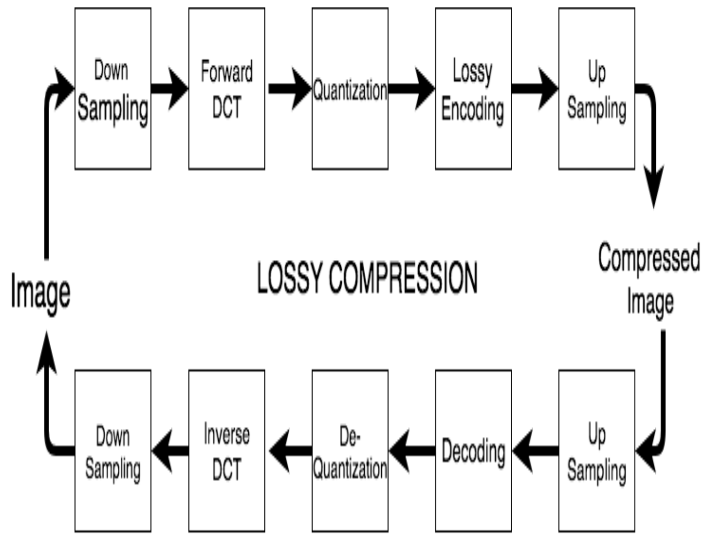

# Image-Compression

## Overview

* Implementation of JPEG Image Compression algorithm with Lloyds-Max quantizer in MATLAB.
* Implemented and tested on Xilinx Artix-7 FPGA.

## Block Diagram

## LLOYDS-MAX ALGORITHM

* Aim- Minimize data loss.
* Assume that the number M of quantizer levels and the pdf fU (u) are given.
1. Choose an arbitrary initial set of M representation points a1 < a2 < ··· < aM. 
2. For each j;1 ≤ j ≤ M−1, set bj = 1/2 (aj+1 + aj ). 
3. For each j;1 ≤ j ≤ M, set aj equal to the conditional mean of U given U ∈ (bj−1, bj ] (where b0 and bM are taken to be −∞ and +∞ respectively). 
4. Repeat steps (2) and (3) until further improvement in MSE is negligible; then stop. 

* The MSE decreases (or remains the same) for each execution of step (2) and step (3). 
* Since the MSE is nonnegative, it approaches some limit. 
* Thus if the algorithm terminates when the MSE improvement is less than some given ε > 0, then the algorithm must terminate after a finite number of iterations.

## Results

